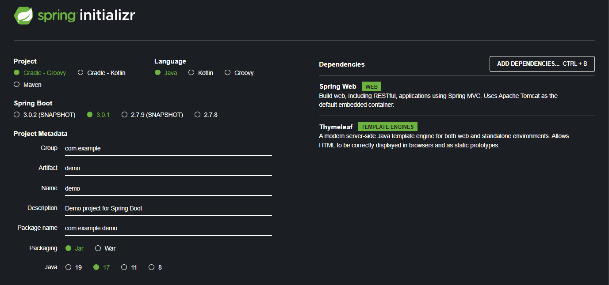

# 회원 관리 서비스

jdbc, jpa 실습 예제


## ✅스프링 프로젝트 생성


[https://start.spring.io/](https://start.spring.io/)



커멘드로 해당 폴더에 진입


./gradlew build 실행

main/resources/static/index.html 파일 생성 (welcome file)


### 서버 실행


## db연동(h2 database)


/sql/ddl.sql 생성


build.gradle에 jdbc, h2데이터베이스 관련 라이브러리 추가

```
implementation 'org.springframework.boot:spring-boot-starter-data-jpa'
runtimeOnly 'com.h2database:h2'
```

<aside>
✨ `spring-boot-starter-data-jpa`는 jdbc 관련 라이브러리를 포함

</aside>

### ✅Jdbc 데이터베이스에 대한 접근 방법


`JdbcTemplate`: 기본적인스프링 JDBC 접근법 (DataSource로 DB와 커넥션)

`DataSource`: DB와 관련된 커넥션 정보를 가짐, DB Connection Pooling기능을 가짐, 빈으로 동록하여 인자를 넘겨줌(Spring은 DataSource로 DB와 커넥션을 획득)


<aside>
✨ `DataSource`는 항상 스프링 컨테이너에서 빈으로 구성해야 한다.

</aside>

### ✅DataBase 연동


- DB와의 연결을 위해 DB서버 정보를 설정 (Property)
    
    ```
    ex. H2 데이터베이스 연결
    경로: /resource/application.properties
    
    spring.datasource.url=jdbc:h2:tcp://localhost/~/test
    spring.datasource.driver-class-name=org.h2.Driver
    spring.datasource.username=sa
    ```
    

- DataSource를 빈으로 등록
    
    ```java
    /SpringConfig.java
    
    @Configuration
    public class SpringConfig {
    
        private final DataSource dataSource;
    
        public SpringConfig(DataSource dataSource) {
            this.dataSource = dataSource;
        }
    
        @Bean
        public MemberService memberService(){
            return new MemberService(memberRepository());
        }
    
        @Bean
        public MemberRepository memberRepository(){
            return new JdbcMemberRepository(dataSource);
        }
    }
    ```
    

## Domain 생성


회원 정보를 담을 `Member` 객체 생성

```java
public class Member {

    public Long id;
    public String name;

    public Long getId() {
        return id;
    }

    public void setId(Long id) {
        this.id = id;
    }

    public String getName() {
        return name;
    }

    public void setName(String name) {
        this.name = name;
    }
}
```

## Repository 인터페이스 생성


```java
public interface MemberRepository {

    Member save(Member member);

    Optional<Member> findById(Long id);

    Optional<Member> findByName(String name);

    List<Member> findAll();
}
```

<aside>
✨ `optional<T>` : [optional<T>](https://www.notion.so/optional-T-954615cce66c473d9691317910cca15a)

</aside>

## JdbcTemplataMemberRepository 생성


```java
@Repository
public class JdbcTemplateMemberRepository implements MemberRepository{

    private final JdbcTemplate jdbcTemplate;

    @Autowired
    public JdbcTemplateMemberRepository(DataSource dataSource) {
        this.jdbcTemplate = new JdbcTemplate(dataSource);
    }

    @Override
    public Member save(Member member) {
        SimpleJdbcInsert jdbcInsert = new SimpleJdbcInsert(jdbcTemplate);
        jdbcInsert.withTableName("member").usingGeneratedKeyColumns("id");

        Map<String, Object> parameters = new HashMap<>();
        parameters.put("name", member.getName());

        Number key = jdbcInsert.executeAndReturnKey(new MapSqlParameterSource(parameters));
        member.setId(key.longValue());

        return member;
    }

    @Override
    public Optional<Member> findById(Long id) {
        List<Member> result = jdbcTemplate.query("select * from member where id = ?", memberRowMapper() ,id);
        return result.stream().findAny();
    }

    @Override
    public Optional<Member> findByName(String name) {
        List<Member> result = jdbcTemplate.query("select * from member where name = ?", memberRowMapper(), name);
        return result.stream().findAny();
    }

    @Override
    public List<Member> findAll() {
        return jdbcTemplate.query("select * from member", memberRowMapper());
    }

    private RowMapper<Member> memberRowMapper(){
        return new RowMapper<Member>() {
            @Override
            public Member mapRow(ResultSet rs, int rowNum) throws SQLException {
                Member member = new Member();
                member.setId(rs.getLong("id"));
                member.setName(rs.getString("name"));
                return member;
            }
        };
    }
```

## MemberService 생성 (MemoryRepository)

---

```java
@Service
public class MemberService {

    private final MemberRepository memberRepository = new MemoryMemberRepository();

    public Long join(Member member){
        //중복 회원 검증
        validateDuplicateMember(member.getName());
        memberRepository.save(member);
        return member.getId();
    }

    private void validateDuplicateMember(String name){
        memberRepository.findByName(name)
                .ifPresent(result -> {
                    throw new IllegalStateException("이미 존재하는 회원입니다.");
                });
    }

    public List<Member> findMembers(){
        return memberRepository.findAll();
    }

    public Optional<Member> findOne(Long memberId){
        return memberRepository.findById(memberId);
    }

    public Optional<Member> findOne(String memberName) {
        return memberRepository.findByName(memberName);
    }
}
```

## Spring Bean에 등록하기

---

1. 각 클래스에 알맞은 애노테이션을 추가하여 Spring Bean에 등록한다.
    
    `@Controller`, `@Service`, `@Repository`
    
2. 자바 코드로 직접 스프링 빈에 등록한다.
    
    ```java
    @Configuration
    public class SpringConfig {
    
        private final DataSource dataSource;
    
        public SpringConfig(DataSource dataSource) {
            this.dataSource = dataSource;
        }
    
        @Bean
        public MemberService memberService(){
            return new MemberService(memberRepository());
        }
    
        @Bean
        public MemberRepository memberRepository(){
            return new JdbcTemplateMemberRepository(dataSource);
        }
    }
    ```
    

실무에서는 주로 정형화된 Controller, Service, Repository같은 코드는 컴포넌트 스캔 방식을 사용한다. 반대로 정형화 되지 않거나, 상황에 따라 구현 클래스를 변경해야 하면 자바 코드로 직접 스프링 빈으로 등록한다.

<aside>
✨ 한 가지 방법으로 스프링 빈에 등록해야 한다. (중복등록으로 에러 발생)

</aside>

DI(Dependency Injection)에는 필드 주입, setter 주입, 생성자 주입 3가지 방법이 존재한다. 의존관계가 실행 중에 동적으로 변하는 경우는 거의 없으므로 `생성자 주입`을 권장한다.

- 생성자 주입
    
    ---
    
    ```java
    @Controller
    public class MemberController {
    
        private final MemberService memberService;
    
        @Autowired
        public MemberController(MemberService memberService) {
            this.memberService = memberService;
        }
    }
    ```
    
- 필드 주입
    
    ---
    
    ```java
    @Controller
    public class MemberController {
    
        @Autowired private MemberService memberService
    }
    ```
    
- setter 주입
    
    ---
    
    단점: 주입 메서드가 public으로 외부에 노출될 가능성이 존재함
    
    ```java
    @Controller
    public class MemberController {
    
        private MemberService memberService;
    		
    		@Autowired
    		public void setMemberService(MemberService memberService){
    				this.memberService = memberService;
    		}
    }
    ```
    

## MemberController 생성

---

```java
@Controller
public class MemberController {

    private final MemberService memberService;

    @Autowired
    public MemberController(MemberService memberService) {
        this.memberService = memberService;
    }

    @GetMapping("/members/new")
    public String create(){
        return "members/createMemberForm";
    }

    @PostMapping("/members/new")
    public String create(MemberForm form){
        Member member = new Member();
        member.setName(form.getName());

        memberService.join(member);
        return "redirect:/";
    }

    @GetMapping("/members")
    public String list(Model model){
        List<Member> members = memberService.findMembers();
        model.addAttribute("members", members);
        return "members/memberList";
    }

}
```

```java
public class MemberForm {

    private String name;

    public String getName() {
        return name;
    }

    public void setName(String name) {
        this.name = name;
    }
```

## JPA

---

JPA는기존의반복코드는 물론이고, 기본적인 SQL도 JPA가 직접만들어서실행해준다.

JPA를사용하면, SQL과 데이터중심의 설계에서객체중심의 설계로패러다임을 전환을할 수있다.

JPA를사용하면 개발생산성을 크게 높일 수있다.

```
// application.properties에 jpa관련 설정 추가

spring.jpa.show-sql=true
spring.jpa.hibernate.ddl-auto=none
```

`show-sql` : JPA가생성하는 SQL을 출력한다.
`ddl-auto` : JPA는테이블을 자동으로생성하는기능을 제공하는데 none 를 사용하면해당 기능을 끈다. `create` 를사용하면엔티티정보를 바탕으로테이블도직접생성해준다.

### JpaMemberRepository 생성

---

```java
public class JpaMemberRepository implements MemberRepository{

    private final EntityManager em;

    public JpaMemberRepository(EntityManager em) {
        this.em = em;
    }

    @Override
    public Member save(Member member) {
        em.persist(member);
        return member;
    }

    @Override
    public Optional<Member> findById(Long id) {
        Member member = em.find(Member.class, id);
        return Optional.ofNullable(member);
    }

    @Override
    public Optional<Member> findByName(String name) {
        List<Member> result = em.createQuery("select m from Member as m where m.name = :name", Member.class)
                .setParameter("name", name)
                .getResultList();

        return result.stream().findAny();
    }

    @Override
    public List<Member> findAll() {
        return em.createQuery("select m from Member m", Member.class)
                .getResultList();
    }
}
```

스프링 빈 설정 변경

```java
@Configuration
public class SpringConfig {

    private final EntityManager em;

    @Autowired
    public SpringConfig(EntityManager em) {
        this.em = em;
    }

    @Bean
    public MemberService memberService(){
        return new MemberService(memberRepository());
    }

    @Bean
    public MemberRepository memberRepository(){
        return new JpaMemberRepository(em);
    }
}
```
